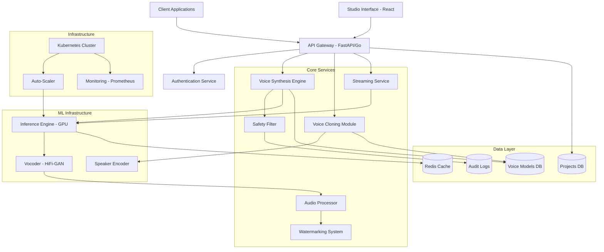

# Design Document: AI Voice Platform

## Overview

The AI Voice Platform is a high-fidelity voice synthesis system designed to provide text-to-speech, voice cloning, and real-time streaming capabilities. The architecture prioritizes low latency (first audio chunk within 200ms), studio-quality output (24kHz+ sample rate), and flexible deployment options.

The system is built around a microservices architecture with the following key components:
- **Voice Synthesis Engine**: Neural TTS models (XTTS-v2, Fish Speech, or Kokoro-82M)
- **Voice Cloning Module**: Zero-shot speaker adaptation using speaker encoders
- **Streaming Service**: Real-time audio delivery via SSE or WebSockets
- **Studio Interface**: React-based web UI for editing and project management
- **API Gateway**: FastAPI/Go/Rust service layer with authentication
- **GPU Infrastructure**: Kubernetes-orchestrated NVIDIA GPU instances with auto-scaling

The platform differentiates itself through ultra-low latency for real-time applications, support for niche accents, and on-premise deployment options for privacy-sensitive use cases.

## Architecture

### System Architecture Diagram



### Deployment Architecture

The platform supports three deployment modes:

1. **Cloud Deployment**: Kubernetes cluster on AWS/GCP/Azure with GPU node pools
2. **On-Premise Deployment**: Self-hosted Kubernetes with customer-managed GPUs
3. **Edge Deployment**: Lightweight inference on edge devices (future consideration)

### Technology Stack

- **Backend**: FastAPI (Python) or Go/Rust for API Gateway
- **ML Framework**: PyTorch for model inference
- **Frontend**: Next.js + React + Tailwind CSS
- **Database**: PostgreSQL for metadata, Redis for caching
- **Message Queue**: Redis Streams for async processing
- **Orchestration**: Kubernetes with NVIDIA GPU Operator
- **Monitoring**: Prometheus + Grafana
- **Streaming**: Server-Sent Events (SSE) or WebSockets

## Components and Interfaces

### 1. API Gateway

**Responsibility**: Handle HTTP requests, authentication, rate limiting, and routing.

**Interface**:
```python
# POST /v1/synthesize
{
  "text": str,
  "voice_id": str,
  "speed": float = 1.0,
  "pitch": int = 0,
  "stream": bool = False
}
→ Returns: Audio bytes (sync) or SSE stream (async)

# POST /v1/clone
{
  "audio_file": bytes,
  "voice_name": str
}
→ Returns: {"voice_id": str, "status": str}

# GET /v1/voices
→ Returns: [{"id": str, "name": str, "created_at": datetime}]

# DELETE /v1/voices/{voice_id}
→ Returns: {"status": "deleted"}
```

**Implementation Notes**:
- Use JWT tokens for authentication
- Implement rate limiting per API key (e.g., 1000 requests/hour)
- Validate input schemas with Pydantic
- Return standardized error responses

### 2. Voice Synthesis Engine

**Responsibility**: Convert text to speech using neural TTS models.

**Core Algorithm**:
```
function synthesize(text: str, voice_embedding: Tensor) -> Audio:
    # Text preprocessing
    tokens = tokenize(text)
    phonemes = text_to_phonemes(tokens)
    
    # Neural TTS inference
    mel_spectrogram = tts_model.forward(phonemes, voice_embedding)
    
    # Vocoding
    audio_waveform = vocoder.forward(mel_spectrogram)
    
    return audio_waveform
```

**Model Selection**:
- **Primary**: XTTS-v2 (proven, multilingual, 24kHz output)
- **Alternative**: Fish Speech V1.5 (faster inference, lower VRAM)
- **Lightweight**: Kokoro-82M (edge deployment)

**Interface**:
```python
class VoiceSynthesisEngine:
    def synthesize(
        self,
        text: str,
        voice_id: str,
        speed: float = 1.0,
        pitch: int = 0
    ) -> np.ndarray:
        """Generate audio from text."""
        pass
    
    def synthesize_streaming(
        self,
        text: str,
        voice_id: str
    ) -> Iterator[np.ndarray]:
        """Generate audio chunks in real-time."""
        pass
```

### 3. Voice Cloning Module

**Responsibility**: Extract voice characteristics from reference audio and create voice embeddings.

**Core Algorithm**:
```
function clone_voice(audio_sample: Audio) -> VoiceEmbedding:
    # Validate audio duration (6-10 seconds)
    if audio_sample.duration < 6 or audio_sample.duration > 10:
        raise InvalidAudioDurationError
    
    # Speaker diarization (detect multiple speakers)
    num_speakers = detect_speakers(audio_sample)
    if num_speakers > 1:
        raise MultipleSpeakersError
    
    # Extract voice embedding
    mel_spectrogram = audio_to_mel(audio_sample)
    embedding = speaker_encoder.forward(mel_spectrogram)
    
    # Normalize embedding
    embedding = normalize(embedding)
    
    return embedding
```

**Speaker Encoder**:
- Use pre-trained speaker encoder (e.g., Resemblyzer, ECAPA-TDNN)
- Output: 256-dimensional voice embedding
- Inference time: < 5 seconds on GPU

**Interface**:
```python
class VoiceCloningModule:
    def clone_voice(
        self,
        audio_bytes: bytes,
        voice_name: str,
        user_id: str
    ) -> str:
        """Create voice model from audio sample."""
        pass
    
    def get_voice_embedding(self, voice_id: str) -> np.ndarray:
        """Retrieve stored voice embedding."""
        pass
```

### 4. Streaming Service

**Responsibility**: Deliver audio in real-time chunks as synthesis progresses.

**Streaming Strategy**:
```
function stream_synthesis(text: str, voice_id: str) -> Stream[AudioChunk]:
    # Split text into sentences
    sentences = split_sentences(text)
    
    for sentence in sentences:
        # Synthesize sentence
        audio_chunk = synthesize(sentence, voice_id)
        
        # Yield chunk immediately
        yield audio_chunk
        
        # Continue to next sentence without waiting
```

**Latency Optimization**:
- Use sentence-level chunking (not word-level to preserve prosody)
- Pre-load voice embeddings into GPU memory
- Use mixed-precision inference (FP16) for 2x speedup
- Implement speculative decoding for autoregressive models

**Interface**:
```python
class StreamingService:
    async def stream_audio(
        self,
        text: str,
        voice_id: str
    ) -> AsyncIterator[bytes]:
        """Stream audio chunks via SSE."""
        pass
```

### 5. Audio Processor

**Responsibility**: Apply post-processing effects to enhance audio quality.

**Processing Pipeline**:
```
function process_audio(audio: Audio) -> Audio:
    # 1. Normalize volume to -16 LUFS
    audio = normalize_loudness(audio, target_lufs=-16)
    
    # 2. De-reverberation (if needed)
    if detect_reverb(audio) > threshold:
        audio = apply_dereverb(audio)
    
    # 3. Noise reduction
    audio = reduce_noise(audio, noise_profile=estimate_noise(audio))
    
    # 4. High-pass filter (remove DC offset)
    audio = highpass_filter(audio, cutoff=80)
    
    return audio
```

**Libraries**:
- **pyloudnorm**: LUFS normalization
- **noisereduce**: Spectral noise reduction
- **scipy.signal**: Filtering operations

**Interface**:
```python
class AudioProcessor:
    def process(
        self,
        audio: np.ndarray,
        sample_rate: int,
        enable_dereverb: bool = True,
        enable_noise_reduction: bool = True
    ) -> np.ndarray:
        """Apply post-processing effects."""
        pass
```

### 6. Safety Filter

**Responsibility**: Detect and block harmful content before synthesis.

**Content Categories to Filter**:
- Hate speech and discrimination
- Violence and threats
- Explicit sexual content
- Misinformation (deepfakes without consent)
- Copyright violations

**Implementation Approach**:
```
function filter_content(text: str) -> FilterResult:
    # 1. Keyword matching (fast first pass)
    if contains_blocked_keywords(text):
        return FilterResult(blocked=True, reason="prohibited_keywords")
    
    # 2. ML-based classification (slower, more accurate)
    toxicity_score = toxicity_classifier.predict(text)
    if toxicity_score > threshold:
        return FilterResult(blocked=True, reason="toxic_content")
    
    # 3. Allow through
    return FilterResult(blocked=False)
```

**Interface**:
```python
class SafetyFilter:
    def check_text(self, text: str) -> tuple[bool, str]:
        """Returns (is_safe, reason)."""
        pass
    
    def verify_voice_consent(
        self,
        audio_bytes: bytes,
        user_id: str
    ) -> bool:
        """Verify user has consent to clone this voice."""
        pass
```

### 7. Watermarking System

**Responsibility**: Embed detectable markers in AI-generated audio.

**Watermarking Approach**:
- Use AudioSeal or similar neural watermarking
- Embed watermark in frequency domain (imperceptible)
- Watermark survives MP3 compression, resampling, and light editing

**Algorithm**:
```
function embed_watermark(audio: Audio, user_id: str) -> Audio:
    # Generate watermark payload
    payload = encode_payload({
        "user_id": user_id,
        "timestamp": current_time(),
        "platform": "ai-voice-platform"
    })
    
    # Embed using neural watermarker
    watermarked_audio = watermark_model.embed(audio, payload)
    
    return watermarked_audio

function detect_watermark(audio: Audio) -> Optional[Payload]:
    # Extract watermark
    payload = watermark_model.extract(audio)
    
    if payload.confidence > threshold:
        return decode_payload(payload)
    else:
        return None
```

**Interface**:
```python
class WatermarkingSystem:
    def embed(self, audio: np.ndarray, user_id: str) -> np.ndarray:
        """Embed watermark in audio."""
        pass
    
    def detect(self, audio: np.ndarray) -> Optional[dict]:
        """Detect and decode watermark."""
        pass
```

### 8. Inference Engine

**Responsibility**: Execute neural network models on GPU with optimal performance.

**Optimization Techniques**:
- **Batching**: Group multiple requests for parallel processing
- **Mixed Precision**: Use FP16 for 2x speedup with minimal quality loss
- **Model Compilation**: Use TorchScript or ONNX Runtime
- **KV-Cache**: Cache attention keys/values for autoregressive models
- **Dynamic Batching**: Combine requests with similar lengths

**Resource Management**:
```
function allocate_gpu_resources(request: SynthesisRequest) -> GPUAllocation:
    # Estimate VRAM requirements
    vram_needed = estimate_vram(request.text_length, request.voice_id)
    
    # Find available GPU with sufficient memory
    gpu = find_available_gpu(vram_needed)
    
    if gpu is None:
        # Queue request for later processing
        queue_request(request)
        return None
    
    # Allocate GPU slot
    return GPUAllocation(gpu_id=gpu.id, slot=gpu.allocate_slot())
```

**Interface**:
```python
class InferenceEngine:
    def infer(
        self,
        model_name: str,
        inputs: dict,
        batch_size: int = 1
    ) -> np.ndarray:
        """Run model inference on GPU."""
        pass
    
    def get_gpu_stats(self) -> dict:
        """Return GPU utilization and memory stats."""
        pass
```

### 9. Auto-Scaler

**Responsibility**: Dynamically adjust GPU instance count based on load.

**Scaling Logic**:
```
function auto_scale():
    while True:
        metrics = get_current_metrics()
        
        # Scale up conditions
        if metrics.queue_depth > 10 or metrics.gpu_utilization > 80:
            if current_instances < max_instances:
                provision_gpu_instance()
        
        # Scale down conditions
        elif metrics.gpu_utilization < 20 and metrics.idle_time > 5_minutes:
            if current_instances > min_instances:
                deallocate_idle_instance()
        
        sleep(30_seconds)
```

**Kubernetes Integration**:
- Use Horizontal Pod Autoscaler (HPA) with custom metrics
- Monitor queue depth via Prometheus
- Set min replicas = 2, max replicas = 10

**Interface**:
```python
class AutoScaler:
    def scale_up(self, target_instances: int) -> None:
        """Provision additional GPU instances."""
        pass
    
    def scale_down(self, target_instances: int) -> None:
        """Deallocate idle GPU instances."""
        pass
    
    def get_scaling_metrics(self) -> dict:
        """Return current scaling metrics."""
        pass
```

### 10. Studio Interface

**Responsibility**: Provide web-based UI for voice editing and project management.

**Key Features**:
- Waveform visualization (using WaveSurfer.js)
- Voice cloning via file upload or microphone recording
- Prosody controls (speed, pitch, emphasis)
- Project management (save, load, export)
- Real-time preview

**Component Structure**:
```
Studio/
├── components/
│   ├── WaveformEditor.tsx      # Audio visualization and editing
│   ├── VoiceSelector.tsx       # Voice model picker
│   ├── ProsodyControls.tsx     # Speed/pitch sliders
│   ├── VoiceCloner.tsx         # Upload/record interface
│   └── ProjectManager.tsx      # Save/load projects
├── hooks/
│   ├── useAudioPlayer.ts       # Audio playback logic
│   ├── useSynthesis.ts         # API calls to synthesis endpoint
│   └── useVoiceCloning.ts      # Voice cloning workflow
└── pages/
    ├── index.tsx               # Main studio page
    └── api/
        └── proxy.ts            # Next.js API routes for backend
```

**Interface (React Components)**:
```typescript
interface StudioProps {
  userId: string;
  apiKey: string;
}

function Studio({ userId, apiKey }: StudioProps) {
  const [text, setText] = useState("");
  const [selectedVoice, setSelectedVoice] = useState<Voice | null>(null);
  const [audioUrl, setAudioUrl] = useState<string | null>(null);
  
  const { synthesize, isLoading } = useSynthesis(apiKey);
  
  const handleSynthesize = async () => {
    const audio = await synthesize(text, selectedVoice.id);
    setAudioUrl(audio);
  };
  
  return (
    <div>
      <VoiceSelector onSelect={setSelectedVoice} />
      <TextEditor value={text} onChange={setText} />
      <ProsodyControls />
      <Button onClick={handleSynthesize} disabled={isLoading}>
        Generate Speech
      </Button>
      {audioUrl && <WaveformEditor audioUrl={audioUrl} />}
    </div>
  );
}
```

## Data Models

### Voice Model

```python
class VoiceModel:
    id: str                      # UUID
    user_id: str                 # Owner user ID
    name: str                    # User-defined name
    embedding: np.ndarray        # 256-dim speaker embedding
    reference_audio_url: str     # S3/storage URL
    created_at: datetime
    updated_at: datetime
    is_shared: bool              # Shared with collaborators
    shared_with: list[str]       # User IDs with access
```

**Storage**:
- Metadata: PostgreSQL
- Embeddings: Redis (for fast access) + S3 (for persistence)
- Reference audio: S3 or object storage

### Project

```python
class Project:
    id: str                      # UUID
    user_id: str                 # Owner user ID
    name: str                    # Project name
    audio_clips: list[AudioClip] # List of audio segments
    created_at: datetime
    updated_at: datetime

class AudioClip:
    id: str                      # UUID
    text: str                    # Input text
    voice_id: str                # Voice model used
    speed: float                 # Playback speed
    pitch: int                   # Pitch adjustment
    audio_url: str               # Generated audio URL
    start_time: float            # Position in timeline
    duration: float              # Clip duration
```

### Synthesis Request

```python
class SynthesisRequest:
    request_id: str              # UUID
    user_id: str                 # Requesting user
    text: str                    # Input text
    voice_id: str                # Voice model ID
    speed: float = 1.0           # Speed multiplier
    pitch: int = 0               # Pitch shift (semitones)
    stream: bool = False         # Streaming mode
    post_process: bool = True    # Apply audio processing
    created_at: datetime
    status: str                  # pending, processing, completed, failed
```

### Audit Log

```python
class AuditLog:
    id: str                      # UUID
    user_id: str                 # User who triggered action
    action: str                  # synthesis, clone, delete, etc.
    resource_id: str             # Voice ID, project ID, etc.
    safety_check: dict           # Safety filter results
    timestamp: datetime
    ip_address: str              # Request origin
    metadata: dict               # Additional context
```


## Correctness Properties

*A property is a characteristic or behavior that should hold true across all valid executions of a system—essentially, a formal statement about what the system should do. Properties serve as the bridge between human-readable specifications and machine-verifiable correctness guarantees.*

### Property Reflection

After analyzing all acceptance criteria, I've identified the following redundancies to eliminate:

- **Voice cloning properties 1.1 and 1.2** can be combined: Creating a voice model and using it for synthesis is one complete workflow
- **API Gateway properties 6.1 and 6.2** are complementary but distinct: One tests validation occurs, the other tests invalid tokens are rejected
- **Watermarking properties 8.4 and 8.5** can be combined: Embedding and detecting watermarks, including after transformations, is one comprehensive property
- **Auto-scaling properties 7.1 and 7.2** are distinct: Scale-up and scale-down have different triggers and should be tested separately
- **Audio processing properties 5.1, 5.2, 5.3** are distinct: Each tests a different processing effect

After reflection, the following properties provide unique validation value without redundancy.

### Voice Cloning Properties

**Property 1: Voice cloning and synthesis workflow**

*For any* valid audio sample between 6 and 10 seconds, creating a voice model and then synthesizing text with that model should produce audio output successfully.

**Validates: Requirements 1.1, 1.2**

**Property 2: Voice cloning rejects short audio**

*For any* audio sample shorter than 6 seconds, attempting to clone a voice should return an error indicating insufficient audio length.

**Validates: Requirements 1.4**

**Property 3: Voice consistency across generations**

*For any* cloned voice model and text input, synthesizing the same text multiple times should produce audio outputs with high similarity (measured by audio fingerprinting or embedding distance).

**Validates: Requirements 1.6**

### Text-to-Speech Properties

**Property 4: Punctuation affects synthesis**

*For any* text input, adding punctuation marks (periods, commas, question marks) should produce audio with different timing characteristics (pauses, intonation) compared to the same text without punctuation.

**Validates: Requirements 2.2**

**Property 5: Number and abbreviation expansion**

*For any* text containing numbers or common abbreviations, the synthesis engine should expand them into speakable forms before generating audio (e.g., "123" → "one hundred twenty-three", "Dr." → "doctor").

**Validates: Requirements 2.3**

**Property 6: Minimum sample rate**

*For any* synthesis request, the generated audio output should have a sample rate of at least 24000 Hz.

**Validates: Requirements 2.4**

**Property 7: Long text processing**

*For any* text input exceeding 5000 characters, the synthesis engine should process it successfully without errors, producing complete audio output.

**Validates: Requirements 2.5**

### Streaming Properties

**Property 8: Resource cleanup on disconnect**

*For any* active streaming session, if the client disconnects, the system should terminate the synthesis process and release all allocated GPU resources within a reasonable time.

**Validates: Requirements 3.4**

### Studio Interface Properties

**Property 9: Speed adjustment affects duration**

*For any* audio clip and speed multiplier between 0.5x and 2.0x, applying the speed adjustment should change the audio duration proportionally (e.g., 2.0x speed should halve the duration).

**Validates: Requirements 4.2**

**Property 10: Pitch adjustment affects frequency**

*For any* audio clip and pitch adjustment between -12 and +12 semitones, applying the pitch shift should change the fundamental frequency of the audio accordingly (measurable via pitch detection).

**Validates: Requirements 4.3**

**Property 11: Project persistence round-trip**

*For any* project containing audio clips, settings, and voice models, saving the project and then loading it should restore all data identically (project name, clip text, voice IDs, speed/pitch settings).

**Validates: Requirements 4.5**

**Property 12: Multi-format export**

*For any* generated audio, exporting in WAV, MP3, and FLAC formats should produce valid audio files that can be decoded and played back successfully.

**Validates: Requirements 4.6**

### Audio Processing Properties

**Property 13: Loudness normalization**

*For any* audio input, applying loudness normalization should produce output with a measured LUFS value within ±1 dB of -16 LUFS.

**Validates: Requirements 5.1**

**Property 14: De-reverberation reduces reverb**

*For any* audio with detectable reverberation, applying de-reverberation processing should reduce the reverb level (measurable by reverb detection algorithms).

**Validates: Requirements 5.2**

**Property 15: Noise reduction improves SNR**

*For any* audio with added synthetic noise, applying noise reduction should increase the signal-to-noise ratio (SNR) compared to the unprocessed audio.

**Validates: Requirements 5.3**

### API Gateway Properties

**Property 16: Authentication validation**

*For any* API request, the gateway should validate the authentication token before processing the request.

**Validates: Requirements 6.1**

**Property 17: Invalid tokens rejected**

*For any* API request with an invalid, expired, or missing authentication token, the gateway should return a 401 Unauthorized response without processing the request.

**Validates: Requirements 6.2**

**Property 18: Request routing**

*For any* valid API request, the gateway should route it to the correct service component based on the endpoint path (e.g., /synthesize → Voice_Synthesis_Engine, /clone → Voice_Cloning_Module).

**Validates: Requirements 6.3**

**Property 19: Rate limiting enforcement**

*For any* user exceeding their rate limit, subsequent API requests should return a 429 Too Many Requests response until the rate limit window resets.

**Validates: Requirements 6.4**

**Property 20: Request logging**

*For any* API request (successful or failed), the system should create an audit log entry containing timestamp, user ID, endpoint, and response code.

**Validates: Requirements 6.5**

### Auto-Scaling Properties

**Property 21: Scale-up on high load**

*For any* situation where request queue depth exceeds 10 or GPU utilization exceeds 80%, the auto-scaler should trigger provisioning of additional GPU instances (up to the maximum limit).

**Validates: Requirements 7.1**

**Property 22: Scale-down on low utilization**

*For any* situation where GPU utilization remains below 20% for 5 minutes, the auto-scaler should deallocate idle instances (maintaining the minimum instance count).

**Validates: Requirements 7.2**

**Property 23: Graceful instance shutdown**

*For any* GPU instance being deallocated, the system should drain all active requests (allowing them to complete) before terminating the instance.

**Validates: Requirements 7.4**

**Property 24: Minimum instance count**

*For any* system state, the number of active GPU instances should never fall below 2 (ensuring high availability).

**Validates: Requirements 7.6**

### Safety and Content Filtering Properties

**Property 25: Content scanning**

*For any* text input submitted for synthesis, the safety filter should scan it for prohibited content categories before allowing synthesis to proceed.

**Validates: Requirements 8.1**

**Property 26: Harmful content rejection**

*For any* text input containing hate speech, violence, or explicit content (based on predefined patterns or ML classification), the safety filter should reject the request and return an appropriate error.

**Validates: Requirements 8.2**

**Property 27: Watermark round-trip with transformations**

*For any* generated audio, embedding a watermark and then applying common transformations (MP3 compression at 128kbps, resampling to 16kHz, volume adjustment) should still allow the watermark to be detected and decoded correctly.

**Validates: Requirements 8.4, 8.5**

**Property 28: Audit logging for filtering**

*For any* content filtering decision (allow or block), the system should create an audit log entry containing the decision, reason, timestamp, and user ID.

**Validates: Requirements 8.6**

### Voice Model Management Properties

**Property 29: Unique voice model IDs**

*For any* set of voice models created by users, all voice model IDs should be unique (no duplicates).

**Validates: Requirements 9.1**

**Property 30: Voice model listing completeness**

*For any* voice model in the system, listing voice models should return entries containing model name, creation date, and reference audio duration for each model.

**Validates: Requirements 9.2**

**Property 31: Voice model sharing**

*For any* voice model shared with specific collaborators, those collaborators should be able to access and use the model for synthesis, while non-collaborators should not have access.

**Validates: Requirements 9.4**

**Property 32: Voice model quota enforcement**

*For any* user account, attempting to create more than 50 custom voice models should be rejected with an error indicating quota exceeded.

**Validates: Requirements 9.5**

### Multi-Language Properties

**Property 33: Mixed language synthesis**

*For any* text input containing multiple languages (e.g., English and Spanish), the synthesis engine should process it successfully and produce audio output without errors.

**Validates: Requirements 10.2**

**Property 34: Unsupported language error**

*For any* synthesis request specifying an unsupported language code, the system should return an error indicating the language is not supported.

**Validates: Requirements 10.5**

### Performance Monitoring Properties

**Property 35: Metrics exposure**

*For any* system state, querying the metrics endpoint should return current values for synthesis latency, GPU utilization, and request throughput.

**Validates: Requirements 12.1**

**Property 36: High latency alerting**

*For any* synthesis request with latency exceeding 500 milliseconds, the monitoring system should generate an alert within a reasonable time.

**Validates: Requirements 12.2**

**Property 37: High error rate alerting**

*For any* time window where error rate exceeds 5%, the monitoring system should generate an alert.

**Validates: Requirements 12.3**

**Property 38: Per-user usage tracking**

*For any* API request, the system should increment the usage counter for the requesting user, and querying usage statistics should return accurate per-user counts.

**Validates: Requirements 12.6**

## Error Handling

### Error Categories

The system defines the following error categories with specific HTTP status codes:

1. **Authentication Errors (401)**
   - Invalid or expired authentication token
   - Missing authentication credentials

2. **Authorization Errors (403)**
   - Insufficient permissions to access resource
   - Attempting to access another user's voice models

3. **Validation Errors (400)**
   - Invalid input parameters (e.g., speed < 0.5 or > 2.0)
   - Malformed request body
   - Audio sample too short for cloning

4. **Rate Limiting Errors (429)**
   - API rate limit exceeded
   - Quota limit reached (e.g., 50 voice models)

5. **Content Safety Errors (451)**
   - Text contains prohibited content
   - Voice cloning consent verification failed

6. **Resource Errors (404)**
   - Voice model not found
   - Project not found

7. **Server Errors (500)**
   - Model inference failure
   - GPU out of memory
   - Database connection failure

8. **Service Unavailable (503)**
   - All GPU instances at capacity
   - System under maintenance

### Error Response Format

All errors follow a consistent JSON structure:

```json
{
  "error": {
    "code": "INVALID_AUDIO_DURATION",
    "message": "Audio sample must be between 6 and 10 seconds",
    "details": {
      "provided_duration": 4.2,
      "min_duration": 6.0,
      "max_duration": 10.0
    },
    "request_id": "req_abc123"
  }
}
```

### Error Handling Strategies

**Retry Logic**:
- Transient errors (503, 500) should be retried with exponential backoff
- Maximum 3 retry attempts
- Client libraries should implement automatic retry

**Graceful Degradation**:
- If audio processing fails, return unprocessed audio with warning
- If watermarking fails, log error but don't block synthesis
- If metrics collection fails, continue serving requests

**Circuit Breaker**:
- If external service (e.g., safety filter API) fails repeatedly, open circuit breaker
- Serve requests with degraded functionality (e.g., skip safety check with audit log)
- Close circuit after cooldown period

**Resource Cleanup**:
- Always release GPU memory on error
- Cancel pending synthesis tasks on client disconnect
- Clean up temporary files after processing

## Testing Strategy

### Dual Testing Approach

The testing strategy employs both unit tests and property-based tests as complementary approaches:

- **Unit tests**: Verify specific examples, edge cases, and error conditions
- **Property tests**: Verify universal properties across all inputs
- Together, they provide comprehensive coverage: unit tests catch concrete bugs, property tests verify general correctness

### Property-Based Testing

**Framework Selection**:
- **Python**: Hypothesis (for backend services)
- **TypeScript**: fast-check (for frontend)
- **Go**: gopter (if using Go for API Gateway)

**Configuration**:
- Minimum 100 iterations per property test (due to randomization)
- Each property test must reference its design document property
- Tag format: `# Feature: ai-voice-platform, Property {number}: {property_text}`

**Example Property Test** (Python with Hypothesis):

```python
from hypothesis import given, strategies as st
import pytest

@given(
    audio_duration=st.floats(min_value=6.0, max_value=10.0),
    voice_name=st.text(min_size=1, max_size=50)
)
def test_voice_cloning_workflow(audio_duration, voice_name):
    """
    Feature: ai-voice-platform, Property 1: Voice cloning and synthesis workflow
    
    For any valid audio sample between 6 and 10 seconds, creating a voice model
    and then synthesizing text with that model should produce audio output successfully.
    """
    # Generate synthetic audio of specified duration
    audio_sample = generate_test_audio(duration=audio_duration)
    
    # Clone voice
    voice_id = voice_cloning_module.clone_voice(audio_sample, voice_name, user_id="test_user")
    assert voice_id is not None
    
    # Synthesize with cloned voice
    text = "Hello, this is a test."
    audio_output = voice_synthesis_engine.synthesize(text, voice_id)
    
    # Verify audio was generated
    assert audio_output is not None
    assert len(audio_output) > 0
    assert audio_output.sample_rate >= 24000
```

### Unit Testing

**Focus Areas**:
- Specific examples demonstrating correct behavior
- Edge cases (empty input, boundary values, special characters)
- Error conditions (invalid tokens, missing parameters)
- Integration points between components

**Example Unit Test**:

```python
def test_voice_cloning_rejects_short_audio():
    """Test that audio shorter than 6 seconds is rejected."""
    audio_sample = generate_test_audio(duration=4.5)
    
    with pytest.raises(InvalidAudioDurationError) as exc_info:
        voice_cloning_module.clone_voice(audio_sample, "test_voice", "test_user")
    
    assert "insufficient audio length" in str(exc_info.value).lower()
    assert exc_info.value.provided_duration == 4.5
```

### Integration Testing

**Scenarios**:
- End-to-end API workflows (authenticate → clone voice → synthesize → download)
- Streaming synthesis with client disconnect
- Auto-scaling under load
- Multi-component interactions (API Gateway → Safety Filter → Synthesis Engine)

### Performance Testing

**Metrics to Measure**:
- First audio chunk latency (target: < 200ms)
- Inter-chunk latency (target: < 50ms)
- Concurrent streaming sessions per GPU (target: 100+)
- Voice cloning time (target: < 5 seconds)
- Audio processing time (target: < 1 second per 10 seconds of audio)

**Tools**:
- Locust or k6 for load testing
- Custom scripts for latency measurement
- NVIDIA nsys for GPU profiling

### Test Data Generation

**Synthetic Audio**:
- Generate test audio using librosa or pydub
- Vary duration, sample rate, number of channels
- Add synthetic noise, reverb for processing tests

**Text Corpus**:
- Use diverse text samples (short, long, multi-language, with punctuation)
- Include edge cases (numbers, abbreviations, special characters)
- Generate harmful content samples for safety filter testing (in isolated test environment)

### Continuous Integration

**CI Pipeline**:
1. Run unit tests on every commit
2. Run property tests (100 iterations) on every PR
3. Run integration tests on merge to main
4. Run performance tests nightly
5. Generate coverage reports (target: 80%+ coverage)

**Test Environment**:
- Use smaller models (e.g., Kokoro-82M) for faster CI tests
- Mock GPU operations for unit tests
- Use real GPU instances for integration/performance tests
